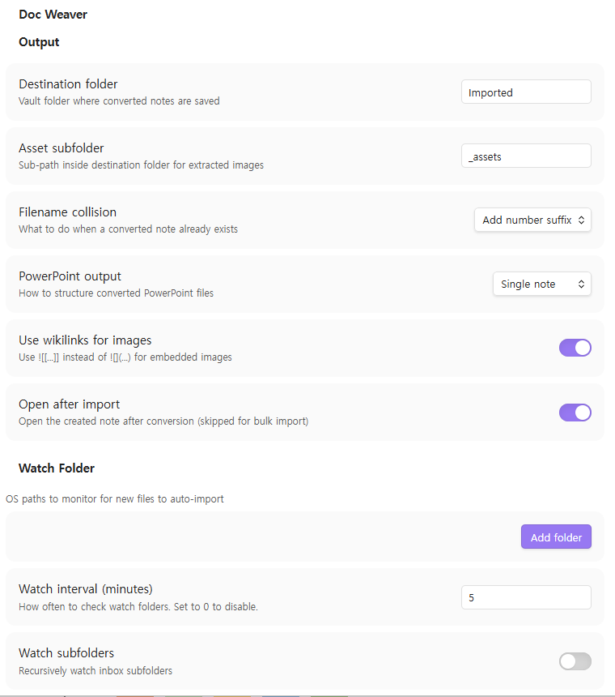
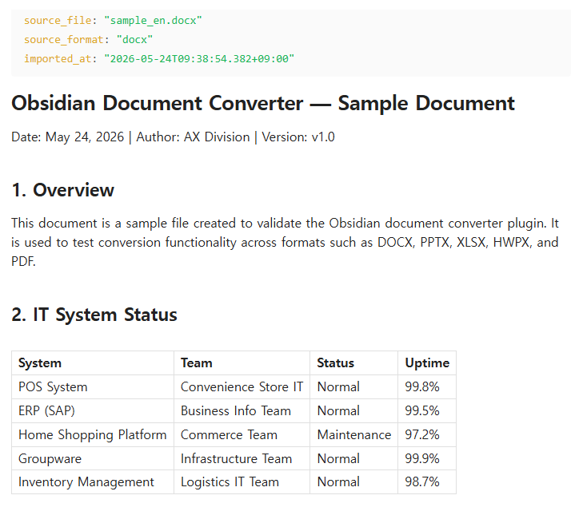
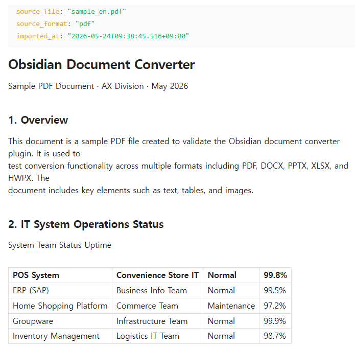
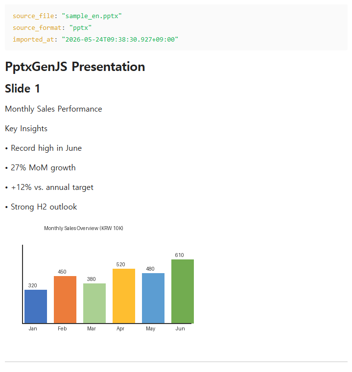
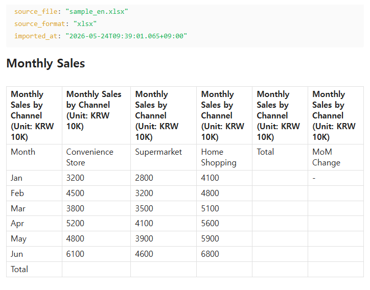
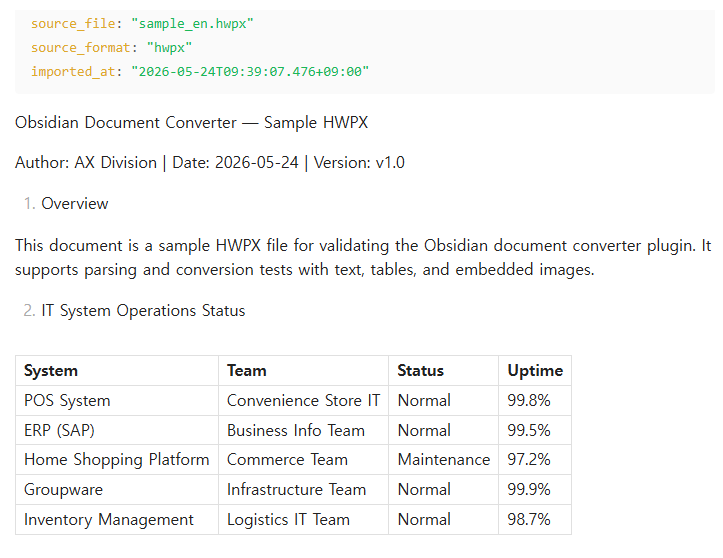

# Document Weaver

> **[한국어 README](https://github.com/GS-AX/doc-weaver/blob/master/README.ko.md)**

**Stop copy-pasting. Drop files, get notes.**

Document Weaver converts Word, PDF, PowerPoint, Excel, and HWP files into clean Markdown — instantly. Drag files onto the window, point a watch folder at your Downloads, or pick files from the command palette. Images are extracted automatically. Front matter is injected. Done.

- 📄 **DOCX** — headings, bold, italic, tables and images, all preserved
- 📑 **PDF** — text layer extracted with automatic heading detection
- 📊 **PPTX** — single long-form note or one note per slide, with speaker notes
- 📈 **XLSX / XLS** — every sheet becomes a clean GitHub-flavored table
- 🇰🇷 **HWP / HWPx** — Korean office format *(beta)*
- 📝 **TXT / CSV** — verbatim or auto-formatted as table

No API keys. No cloud. Fully offline.  
The local-file companion to [Confluence Weaver](https://github.com/GS-AX/confluence-weaver).

---

## Screenshots

### Menu


### Conversion Examples

| DOCX | PDF |
|---|---|
|  |  |

| PPTX | XLSX |
|---|---|
|  |  |

### HWPx


---

## Supported Formats

| Format | Extension | Fidelity |
|---|---|---|
| Word | `.docx` | ★★★★ — headings, bold/italic, tables, images, embedded charts → markdown table. `.doc` not supported. |
| PowerPoint | `.pptx` | ★★★☆ — slide titles, bullets, speaker notes, images. Animations and transitions not preserved. |
| PDF | `.pdf` | ★★★☆ — text layer + heading detection. Charts extracted as images. Scanned PDFs rendered as page images. Tables as plain text only. |
| Excel | `.xlsx` / `.xls` | ★★☆☆ — each sheet as GFM table. Chart extraction not supported. |
| HWP | `.hwp` | ★★☆☆ ⚠ beta — binary format, best-effort. Merged cells and complex formatting may be lost. |
| HWPx | `.hwpx` | ★★★☆ ⚠ beta — ZIP+XML, better fidelity than HWP. Inline image placement depends on XML structure. |
| Plain text / CSV | `.txt` / `.csv` | ★★★★ — verbatim or auto-formatted as GFM table. |

---

## Installation

### Community Plugins (recommended)
1. Obsidian → **Settings → Community Plugins → Browse**
2. Search for **Document Weaver** and click **Install**
3. Click **Enable**

### Manual
1. Download `main.js` and `manifest.json` from [Releases](https://github.com/GS-AX/doc-weaver/releases)
2. Copy both files to `.obsidian/plugins/document-weaver/` inside your Vault
3. Obsidian → **Settings → Community Plugins** → enable **Document Weaver**

---

## Usage

### Import entry points

| Method | How |
|---|---|
| **Command palette** | `Doc Weaver: Import file…` → system file picker (multi-select supported) |
| **Drag & drop** | Drop supported files anywhere onto the Obsidian window — editor, file explorer, anywhere. Document Weaver intercepts the drop and converts automatically. Unsupported files (images, `.md`, etc.) pass through to Obsidian as normal. |
| **Watch folder** | Configure inbox folders in settings; new files are converted automatically |

### Output

Converted notes are saved to the configured destination folder (default: `Imported/`):

```markdown
---
source_file: "report.docx"
source_format: "docx"
imported_at: "2026-05-23T10:00:00+09:00"
---

# Report Title
...
```

Embedded images are extracted to `Imported/_assets/<note-name>/image-001.png` and linked with `![[image-001.png]]` (or a markdown link, per setting).

### Completion notices

- Single file: `✅ report.docx → Imported/report.md (12 headings, 3 images)`
- Bulk: `✅ 5 files imported (1 warning) → Imported/`
- Errors are appended to `Imported/_import_errors.md`

### PowerPoint modes

| Mode | Output |
|---|---|
| **Single note** (default) | One `.md` file with `## Slide N` sections separated by `---` |
| **Per-slide** | One `.md` per slide + an index note with `[[wikilinks]]` |

---

## Settings

### Output
| Setting | Default | Description |
|---|---|---|
| Destination folder | `Imported` | Vault folder for converted notes |
| Asset subfolder | `_assets` | Sub-path for extracted images |
| Filename collision | `number` | `skip` / `overwrite` / add number suffix |
| PowerPoint output | `single` | Single note or per-slide notes |
| Use wikilinks | ON | `![[...]]` vs `` for images |
| Open after import | ON | Open the note after conversion (skipped for bulk) |

### Watch Folder
| Setting | Default | Description |
|---|---|---|
| Watch folders | (none) | OS paths to monitor (add multiple) |
| Watch interval (min) | `5` | Set to 0 to disable |
| Watch subfolders | OFF | Recursively watch inbox subfolders |
| After import | `archive` | `archive` / `delete` / `keep` |
| Archive folder | (none) | OS path to move originals after conversion |

### Advanced
| Setting | Default | Description |
|---|---|---|
| Show HWP beta features | OFF | Enable HWP/HWPx conversion (limited quality) |
| Language | Auto | Auto / English / 한국어 / 日本語 / 中文 |

---

## v1.0 Non-Goals

- **No reverse export** — Markdown → Word/PDF not supported
- **No OCR** — scanned PDFs produce a stub note only
- **No cloud sync** — local files only (use Confluence Weaver for remote)
- **HWP/HWPx** — beta quality; complex formatting and merged table cells may be lost
- **PDF tables** — rendered as plain text in v1 (heuristic reconstruction planned for v2)

---

## License

MIT © [GS-AX](https://github.com/GS-AX)
